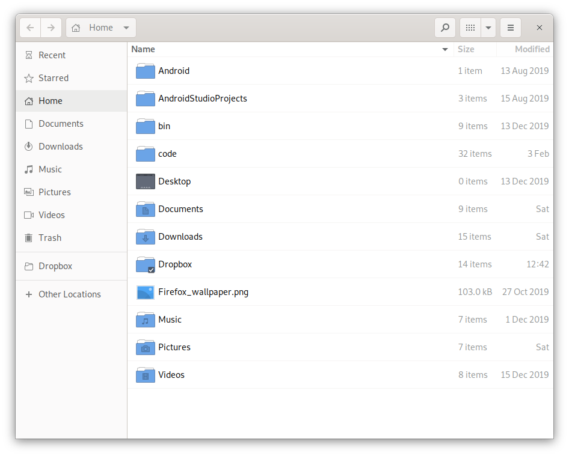
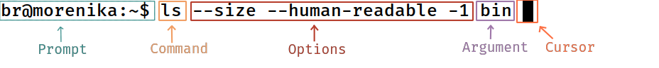
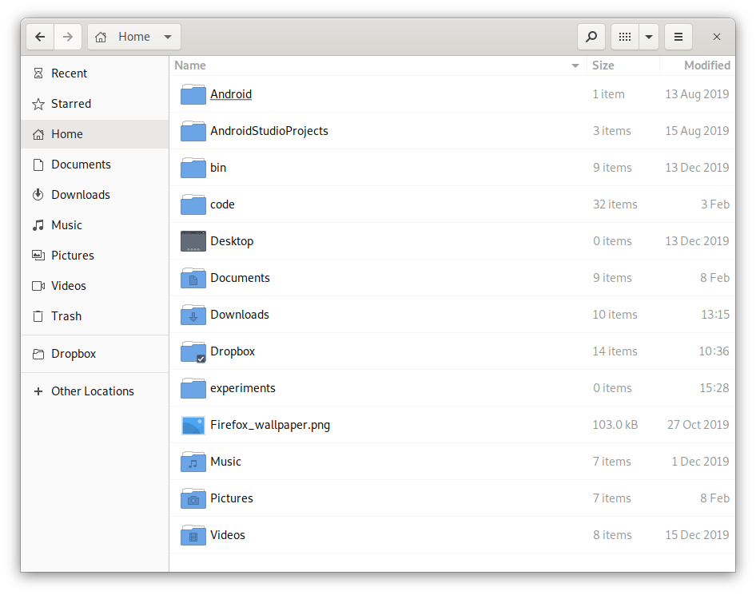
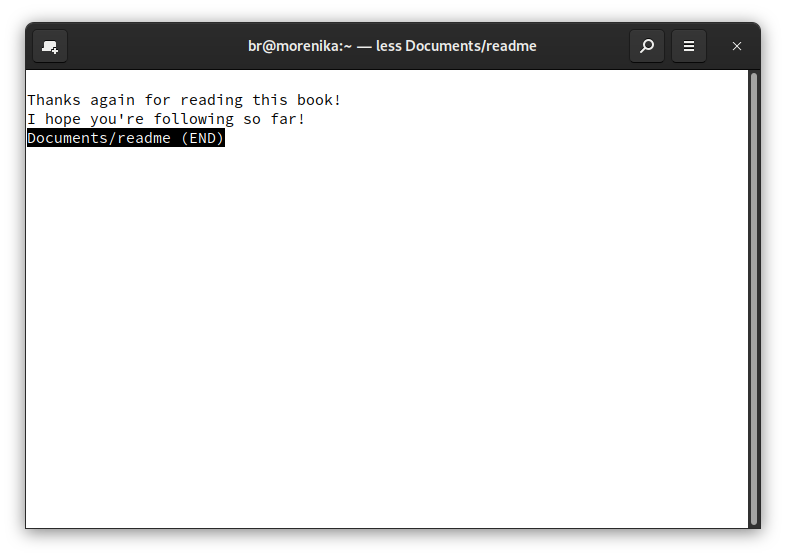
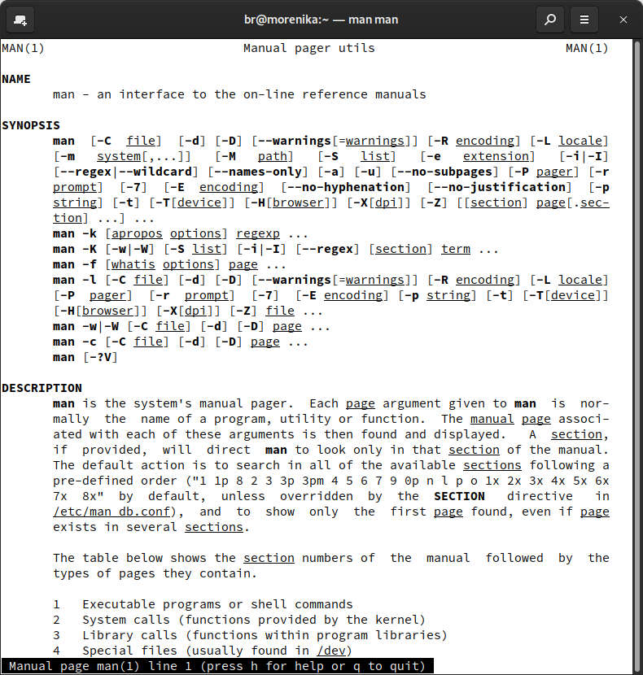
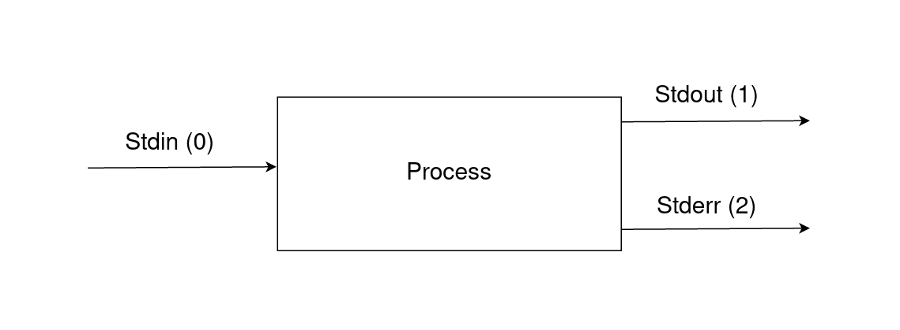

Title: Discovering the terminal
Date: 2020-03-05
Category: Essential Tools and Practices for the Aspiring Software Developer
Description: In which we help you take your first steps in the terminal
Image: https://blog.balthazar-rouberol.com/images/terminal/physical-terminal.png
Tags: terminal

<header>
<p>
    This article is part of a self-published book project by Balthazar Rouberol and <a href=https://etnbrd.com>Etienne Brodu</a>, ex-roommates, friends and colleagues, aiming at empowering the up and coming generation of developers. We currently are hard at work on it!
</p>
<p>
  If you are interested in following the project, we invite you to join the <a href=https://balthazar-rouberol.us4.list-manage.com/subscribe?u=1f6080d496af07a836270ff1d&id=81ebd36adb>mailing list</a>!
</p>
</header>

## Table of Contents

<!-- MarkdownTOC autolink="true" levels="2" autoanchor="true" -->

- [What is a terminal?](#what-is-a-terminal)
- [Your first steps](#your-first-steps)
- [Managing files](#managing-files)
- [Learning new options](#learning-new-options)
- [Command Input/Output streams](#command-inputoutput-streams)
- [Composing commands](#composing-commands)
- [Escaping from bad situations](#escaping-from-bad-situations)
- [Summary](#summary)
- [Going further](#going-further)

<!-- /MarkdownTOC -->


# Discovering the terminal

When people picture a programmer, it’s not uncommon for them to imagine
someone sitting in front of a computer screen displaying undecipherable
streams of text going by really fast, like in The Matrix. Let’s set the
record straight. This is not true, at least for the most part. The
Matrix however got some things right. A programmer works with *code*,
which, as its name indicates, has to be learned before it can be
understood. Anyone not versed in the trade of reading and writing code
would only see gibberish. Another thing these movies usually get right
is the fact that a programmer types commands in a *terminal*.

<a id="what-is-a-terminal"></a>
## What is a terminal?

Most of the applications people use everyday have a <span class="gls"
key="gui">Graphical User Interface (GUI)</span>. Think about Photoshop,
Firefox, or your smartphone apps. These application have immense
capabilities, but the user is mostly bound by the features implemented
in them in the first place. What if you suddenly wanted to have a new
feature in Photoshop that just wasn’t available? You would possibly end
up either waiting for the newest version to be released, or have to
install another application altogether.

One of the most important tools in a programmer toolbox is of a
different kind though. It’s called the *<span class="gls"
key="terminal">terminal</span>*, which is a *<span class="gls"
key="cli">command-line</span> application*. That is to say that you
enter a command, your computer executes that command, and displays the
output in the terminal.

In other words, this is an applications in which you give your computer
orders. If you know how to ask, your computer will be happy to comply.
However, if you order it to do something stupid, it will obey.

> — You: “Computer, create that folder.”
>
> — Computer: “Sure.”
>
> — You: “Now put all the files on my Desktop in that new folder.”
>
> — Computer: “No problem.”
>
> — You: “Now delete that folder forever with everything inside.”
>
> — Computer: “Done.”
>
> — You: “Wait, no, my mistake, I want it back.”
>
> — Computer: “Sorry, it’s all gone, as you requested.”
>
> — You: “…”
>
> — Computer: “I’m not even sorry.”

Never has this famous quote been more true:

> With great power come great responsibility

Learning your way around a terminal really is a fundamental shift in how
you usually interact with computers. Instead of working inside the
boundaries of an application, a terminal gives you free and unlimited
access to every part of the computer. The littles wheels are off, and
you are only limited by the number of commands you know. Consequently,
learning how to use the terminal will give you insights about how your
computer works. Let’s see what we can do. We’ll start small, but trust
me, it gets better.

<a id="your-first-steps"></a>
## Your first steps

First off, let’s define a couple of words.

A terminal is an application you can open on your computer, in which
you’ll be able to type commands in a command line interface (CLI). When
you hit the <kbd>Enter</kbd> key, the command will be executed by a
shell, and the result is displayed back in the terminal.

In the early days of computing, video terminals were actual physical
devices, used to execute commands onto a remote computer that could take
a whole room.


<span class=imgcaption>The DEC VT100, a physical video terminal dating back 1978</span>

Nowadays, terminals are programs run into a graphical window, emulating
the behavior of the video terminals of old.


<span class=imgcaption>This is what a terminal looks like nowadays.</span>

Different operating systems come with different terminals and different
shells pre-installed, but most common shell out there is certainly `bash`.

Before we go any deeper, let’s open a terminal! The way you do this however depends on your operating system.

### Opening a terminal

#### On MacOS

Open the `Finder` app, click on `Applications` on the left pane, then
enter the `Utilities` directory, then execute the `Terminal` app. You
can also use the Spotlight search by clicking on the magnifying glass
icon on the top right corner of your screen (or use the <kbd>Cmd</kbd>
<kbd>Space</kbd> keyboard shortcut), and type `Terminal`.

#### On Linux

Depending on the Linux distribution you use, it might come with XTerm,
Gnome-Terminal or Konsole pre-installed. Look for any of these in your
applications menu. A lot of Linux installation use the
<kbd>Ctrl</kbd> - <kbd>Alt</kbd> - <kbd>T</kbd> keyboard shortcut to
open a terminal window.

#### On Windows

Windows is a special case: Linux and MacOS come with bash pre-installed, whereas Windows does not. It comes with 2 built-in shells: `cmd` and `Powershell`. The rest of this tutorial and its following chapters however assume you are running bash. The reason for that is that `bash` is pretty much ubiquitous, whether it's on a personal workstations or on servers. On top of that, bash comes with a myriad of tools and commands that will be detailed in the next chapter.

Fortunately, Windows 10 can now natively run bash since 2019 by using the _Windows Subsystem for Linux_ (WSL). We suggest you follow the instructions from this [tutorial](https://itsfoss.com/install-bash-on-windows/).


<span class=imgcaption>Running bash on Windows is now possible</span>

### Running our first command

When you open your terminal, the first thing you will see is a *<span
class="gls" key="prompt">prompt</span>*. It is what is displayed every
time the shell is ready for its next order. It is common for the prompt
to display information useful for the user. In my case, `br` is my
username, and `morenika` is my computer’s name (its *<span class="gls"
key="hostname">hostname</span>*).


<span class=imgcaption>`br@morenika:~$` is my prompt</span>

The black rectangle is called a *cursor*. It represents your current
typing position.

<div class="Note" markdown="1">

What *your* prompt actually looks like depends on your operating system
and your shell. Don’t worry if it does not look exactly the same as the
one in the following examples.

</div>

The first command we will run is `ls` (which stands for *list
directory*). By default, that command lists all directories and files
present in the directory we currently are located into. To run that
command, we need to type `ls` after the prompt, and then hit
<kbd>Enter</kbd>

The text that is displayed after our command and before the next prompt
is the command’s *output*.

``` bash
br@morenika:~$ ls
Android                code       Downloads              Music
AndroidStudioProjects  Desktop    Dropbox                Pictures
bin                    Documents  Firefox_wallpaper.png  Videos
```

These are all the files and directories located in my personal directory
(also called *<span class="gls" key="homedir">home directory</span>*).
Let’s open a graphical file explorer and check, just to be sure.


<span class=imgcaption>As expected, we weren’t lied to</span>

<div class="Warning" markdown="1">

The shell is sensitive to casing: a lower-case command is not the same
thing as it’s upper case equivalent.

``` bash
br@morenika:~$ LS
bash: LS: command not found
```

</div>

As of now, we will ignore the `br@morenika:~$` prompt prefix and will
only use `$`, to keep our examples short.

### Commands arguments

In our last example, we listed all files and directories located in my
home directory. What if I wanted to list all files located in the `bin`
directory that we can see in the output? In that case, I could pass
`bin` as an *argument* to the `ls` command.

``` bash
$ ls bin
bat            fix-vlc-size  lf          terraform  vpnconnect
clean-desktop  itresize      nightlight  tv-mode
```

By passing the `bin` argument to the `ls` command, we told it where to
look, and we thus changed its behavior. Note that it is possible to pass
more than one argument to a command.

``` bash
$ ls Android bin
Android:
Sdk

bin:
bat  clean-desktop  fix-vlc-size  itresize  lf  nightlight  terraform  tv-mode  vpnconnect
```

In that example, we passed two arguments to `ls`: `bin` and `Android`.
`ls` then proceeded to list the content of each these 2 directories.

Think about how you would have done that in a File explorer GUI. You
probably would have gone into the first directory, then gone back to the
parent directory and finally proceeded with the next directory. The
terminal allows you to be more efficient.

### Command options

Now, let’s say I’d also like to see how big files located under `bin`
are. No problem! The `ls` command has *options* we can use to adjust its
behavior. The `-s` option causes `ls` to display each file size, in
kilobytes.

``` bash
$ ls -s bin
total 52336
 4772 bat                4 itresize    44296 terraform
    4 clean-desktop   3244 lf              4 tv-mode
    4 fix-vlc-size       4 nightlight      4 vpnconnect
```

While this is nice, I’d prefer to see the file size in a human-readable
unit. I can add the `-h` option to further specify what `ls` has to do.

``` bash
$ ls -s -h bin
total 52M
4.7M bat            4.0K itresize     44M terraform
4.0K clean-desktop  3.2M lf          4.0K tv-mode
4.0K fix-vlc-size   4.0K nightlight  4.0K vpnconnect
```

I can separate both options with a space, or also group them as one
option.

``` bash
$ ls -sh bin
total 52M
4.7M bat            4.0K itresize     44M terraform
4.0K clean-desktop  3.2M lf          4.0K tv-mode
4.0K fix-vlc-size   4.0K nightlight  4.0K vpnconnect
```

I’d finally like each file and its associated size to be displayed on
its own line. Enter the `-1` option!

``` bash
 $ ls -s -h -1 bin
total 52M
4.7M bat
4.0K clean-desktop
4.0K fix-vlc-size
4.0K itresize
3.2M lf
4.0K nightlight
 44M terraform
4.0K tv-mode
4.0K vpnconnect
```

Short options make it easy to type a command quickly, but the result can
be hard to decipher after a certain amount of options, and you might
find yourself wondering that the command is doing in the first place.
Luckily, options can have a *long form* and a *short form*. For example,
`-s` can be replaced by its long form `--size`, and `-h` by
`--human-readable`.

``` bash
$ ls --size --human-readable -1 bin
total 52M
4.7M bat
4.0K clean-desktop
4.0K fix-vlc-size
4.0K itresize
3.2M lf
4.0K nightlight
 44M terraform
4.0K tv-mode
4.0K vpnconnect
```

The command feels way more self-explanatory this way! You’ll notice that
we still used the short form for the `-1` option. The reason for that is
that this option simply does not have a long form.

### Takeaways

-   A terminal is an application through which you interact with a shell
-   You can execute commands by typing them in the shell’s command-line
    and hitting <kbd>Enter</kbd>
-   A command can take 0, 1 or more arguments
-   A command’s behavior can be changed by passing options
-   By convention, options can have have multiple forms: a short and/or
    a long one.


<span class=imgcaption>Here is a summary of the different parts of a command</span>

<a id="managing-files"></a>
## Managing files

So far, we’ve seen how to run a command, changing its behavior by
passing command-line arguments and options, and that `ls` is used to
list the content of a directory. It’s now time to learn about how to
managing your files, by creating files and directories, copying and
moving them around, creating links, etc. The goal of this section is to
teach you how to do everything you usually do in your file explorer, but
in your terminal.

### `pwd`, `cd`: navigating between directories

Up to now, every command we’ve run were executed from our *<span
class="gls" key="homedir">home directory</span>* (the directory in which
you have all your documents, downloads, etc). The same way you can
navigate directories in a graphical file editor, you can do it in a
terminal as well.

Before going anywhere, we first need to find know where we are. Enters
`pwd`, standing for *print working directory*. This command displays
your current working directory (*a.k.a* where you are).

``` bash
$ pwd
/home/br
```

Now that we found our bearings, we can finally move around, for example
to the `experiments` directory we’ve created in the previous part. We
can do that with the `cd` command, standing for (you might have guessed
it) *change directory*.

``` bash
$ cd experiments
$ pwd
/home/br/experiments
$ cd ./art
$ pwd
/home/br/experiments/art
$ cd paintings
$ pwd
/home/br/experiments/art/paintings
```

As `paintings` is empty, we can’t go any further. However, we can also
go back to the *parent directory* (the directory containing the one we
are currently into) using `cd ..`.

``` bash
$ pwd
/home/br/experiments/art/paintings
$ cd ..
$ pwd
/home/br/experiments/art
```

We don’t have to always change directory one level at the time. We can
go up multiples directories at a time.

``` bash
$ pwd
/home/br/experiments/art
$ cd ../..
$ pwd
/home/br
```

We can also go several directories down at the same time

``` bash
$ pwd
/home/br
$ cd experiments/art/paintings
```

Running `cd` without arguments takes you back to your home directory.

``` bash
$ pwd
/home/br/experiments/art/paintings
$ cd
$ pwd
/home/br
```

Running `cd -` takes you back to your previous location.

``` bash
$ pwd
/home/br/experiments/art/paintings
$ cd /home/br
$ cd -
$ pwd
/home/br/experiments/art/paintings
```

You might wonder why `cd ..` takes you back to the parent directory?
What does `..` mean? To understand this, we need to explore how *paths*
work.

### Paths: root, absolute and relative

If you have never used a terminal before, and have only navigated
between directories using a graphical file explorer, the notion of
*path* might be a bit foreign. A path is a unique location to a file or
a folder on your file system. The easiest way to explain it is by
describing how files and directories are organized on your disk.

The base directory (also called <span class="gls" key="rootdir">root
directory</span>, and referred as `/`) is the highest directory in the
hierarchy: it contains every single other file and directory in your
system, each of these directories possibly containing others, to form a
structure looking like a tree.


<span class=imgcaption>Your disk is organized like a tree</span>

Let’s look a what that `/` root directory contains.

``` bash
$ ls /
bin  boot  dev  etc  home  lib  lib64  lost+found  media
mnt opt  proc  root  run  sbin  srv  sys  tmp  usr  var
```

Ok so, there is a couple of things in there. We have talked about home
directories before, remember? It turns out that all the users’ home
directories are located under the `home` directory. As `home` is located
under `/`, we can refer it via its *<span class="gls"
key="abspath">absolute path</span>*, that is to say the full path to a
given directory, starting from the root directory. In the case of
`home`, its absolute path is `/home`, as it is directly located under
`/`.

<div class="Note" markdown="1">

Any path starting by `/` is an absolute path.

</div>

We can then use that path to inspect the content of the `home` directory
with the `ls` command.

``` bash
$ ls /home
br
```

The absolute path of `br` is `/home/br`. Each directory is separated
from its parent by a `/`. This is why the root directory is called `/`:
it is the only directory without a parent.

Any path that does not start with `/` will be a *<span class="gls"
key="relpath">relative path</span>*, meaning that it will be relative to
the current directory. When we executed the `ls bin` command, `bin` was
actually a relative path. Indeed, we executed that command while we were
located in `/home/br`, meaning that the absolute path of `bin` was
`/home/br/bin`.

Each folder on disk has a link to itself called `.`, and and link to its
parent folder called `..`.


<span class=imgcaption>The `.` link points to the folder itself and the `..` link points to the folder’s parent</span>.

We can use these `.` and `..` links when constructing relative paths.
For example, were you current located in `/home/br`, you could refer to
the `Android` folder as `./Android`, meaning “the `Android` folder
located under `.` (the current directory)”.

``` bash
$ ls ./Android
Sdk
```

Were you located under `/home/br/Android`, you could also refer as
`/home/br/Downloads` as `../Downloads`.


<span class=imgcaption>Following `Android`’s `..` link takes you back to the `home` director</span>

<div class="Note" markdown="1">

`ls -a` allows you to see *hidden files*, a.k.a all files starting with
a dot. We can indeed see the `.` and `..` links!

``` bash
$ ls -a
.  ..  Sdk
```

</div>

### `mkdir`: creating directories

<div class="Note" markdown="1">

In order to make sure that we don’t mess with your personal files when
testing out the commands from this chapter, we will start by creating a
new directory to experiment in, called `experiments`.

</div>

You can create a new directory using the `mkdir` command, which stands
for *make directories*. By executing the command `mkdir experiments`,
you will create the `experiments` directory in your current directory.
Let’s test this out.

``` bash
$ ls
Android                code       Downloads              Music
AndroidStudioProjects  Desktop    Dropbox                Pictures
bin                    Documents  Firefox_wallpaper.png  Videos

$ mkdir experiments
$
```

Notice that the `mkdir` command did not display anything. It might feel
unusual at first, but this is the philosophy of these commands: only
display something if something went bad. In other terms, no news if good
news.

We can now check that the directory has been created.

``` bash
$ ls
Android          bin   Desktop  Downloads  experiments      Music     Videos
AndroidStudioProjects  code  Documents  Dropbox    Firefox_wallpaper.png  Pictures
```

We can also see that directory by opening our file explorer.


<span class=imgcaption>The directory we have just created in the terminal can be seen in our file explorer. The terminal displays the information as text, and the file explorer displays it in a graphical form.</span>

Running `mkdir` on a pre-existing command causes it to fail and display
an error message.

``` bash
$ mkdir experiments
mkdir: experiments: File exists
```

What if we wanted to create a directory in `experiments` called `art`,
and another directory called `paintings` itself located into `art`?

``` bash
$ mkdir experiments/art/paintings
mkdir: experiments/art: No such file or directory
```

Something clearly went wrong here. `mkdir` is complaining that it cannot
create `paintings` within `experiments/art` as it does not exist. We
could create `art` and then `paintings`, in two separate commands, but
fortunately, `mkdir` provides us with a `-p` option that causes `mkdir`
to succeed even if directories already exist, and that will create each
parent directory.

``` bash
-p, --parents: no error if existing, make parent directories as needed
```

This looks like exactly what we need in that case! Let’s see if it works
as expected.

``` bash
$ mkdir -p experiments/art/paintings
$ ls experiments
art
$ ls experiments/art
paintings
$ ls experiments/art/paintings
$
```

### `cp`, `mv`: moving files around

`cp` (standing for `copy`) allows you to copy a file or a directory to
another location.

``` bash
$ cp Documents/readme experiments/art
$ ls experiments/art
paintings   readme
$ ls Documents
readme
```

You can also move the file from a location to another by using `mv`.

``` bash
$ mv experiments/art/readme experiments
$ ls experiments
art   readme
$ ls experiments/art
paintings
```

That does not seem to work on directories however.

``` bash
$ cp experiments/art experiments/art-copy
cp: experiments/art is a directory (not copied).
```

By default, `cp` only works on files, and not on directories. We need to
use the `-r` option to tell `cp` to recursively copy `experiments/art`
to `experiments/art-copy`, meaning `cp` will copy the directory and
every file and directories it contains.

``` bash
$ cp -r experiments/art experiments/art-copy
$ ls experiments
art-copy art  readme
$ ls experiments/art
paintings
$ ls experiments/art-copy
paintings
```

Finally, you can use `mv` to rename a file or a directory. It might
sound surprising that there is not `rn` or `rename` command, but
renaming a file is actually just moving it to another location in the
same directory.

``` bash
$ mv experiments/readme experiments/README
$ ls experiments
README    art-copy art
```

### `rm`: removing files and directories

The `rm` copy allows you to delete files and directories.

<div class="Warning" markdown="1">

**Be careful with `rm`**, when a file is deleted, it is not moved to the
trash, it is gone.

``` bash
$ rm experiments/README
$ ls experiments
art-copy art
```

</div>

`rm` behaves like `cp`: it only allows you to remove directories by
using the `-r` option.

``` bash
$ rm experiments/art
rm: experiments/art: is a directory
$ rm -r experiments/art
$ ls experiments
art-copy
$ rm -r experiments/art-copy
$ ls experiments
$
```

### `ln`: creating links

Have you ever created a shortcut to a file on your desktop? Behind the
scenes, this works using a *symbolic link*. A link points to the
original file, and allows you to access that file from multiple places,
without actually having to store multiple copies on disk.

We can create such a link by using the `ln -s` command (`-s` stands for
*symbolic*).

``` bash
$ pwd
/home/br
$ ln -s Documents/readme Desktop/my-readme
```

Using the `-l` option of `ls`, we can see where a link points to.

``` bash
$ ls -l Desktop
total 0
lrwxr-xr-x  1 br  br  21 Jan 17 16:48 my-readme -> /home/br/Documents/readme
```

<div class="Note" markdown="1">

My personal mnemonic to remember the order of arguments is by
remembering *s for source*: the source file goes after the `-s` option.
`ln -s <source> <destination>`

</div>

### `tree`: visualizing files and subfolders

`tree` displays the content of the current directory (or argument
directory) and its subfolders in a tree-like representation. It is very
useful to have a quick look at the current content of a directory,

``` bash
$ tree experiments
experiments
|__ art
    |__ paintings

2 directories, 0 files
```

<div class="Note" markdown="1">

`tree` might not be installed by default, depending on your system. We
mention it here as we will re-use it throughout the chapters.

</div>

<a id="learning-new-options"></a>
## Learning new options

### Getting help

If you are wondering how you will be able to remember all these options,
don’t worry. Nobody expects you to know all of the options of all the
commands by heart. You can rely on the commands’ documentation instead
of having to memorize them all.

Most of the commands out there take a `-h` (or `--help`) option that
will display the list of options the command itself can take, and what
they do.

``` bash
$ ls --help
Usage: ls [OPTION]... [FILE]...
List information about the FILEs (the current directory by default).
Sort entries alphabetically if none of -cftuvSUX nor --sort is specified.

Mandatory arguments to long options are mandatory for short options too.
  -a, --all                  do not ignore entries starting with .
  -A, --almost-all           do not list implied . and ..
      --author               with -l, print the author of each file
  -b, --escape               print C-style escapes for nongraphic characters
      --block-size=SIZE      with -l, scale sizes by SIZE when printing them;
                               e.g., '--block-size=M'; see SIZE format below
  -B, --ignore-backups       do not list implied entries ending with ~
  -c                         with -lt: sort by, and show, ctime (time of last
                               modification of file status information);
                               with -l: show ctime and sort by name;
                               otherwise: sort by ctime, newest first
[cut for brevity]
```

It’s interesting to note that some options accept both short and long
forms, like `-a/--all`, while some others only accept a short form
(`-c`) or a long form (`--author`). There’s no real rule there, only
conventions. A command might not even accept a `--help` option, but most
if not all the common ones do.

<div class="Note" markdown="1">

`-h` is not always the short option for `--help`. Indeed, we’ve seen
that `ls --help` prints an overview of all available commands, whereas
`ls -h` displays units in a human-readable format!

</div>

### Reading the manual

Sometimes, there’s no `--help` option available, or its output isn’t
clear or verbose enough for your taste, or the output is too long to
navigate easily. It’s often a good idea to read the command’s *`man`*
page (*man* stands for *manual*).

Let’s give it a go, by typing the following command.

``` bash
$ man ls
```


<span class=imgcaption>`man ls` displays the manual of the `ls` command: everything you need to know about what `ls` can be used for.</span>

#### Reading the synopsis

`man` provides you with a *synopsis*, describing a specific usage of the
command on each line, along with the associated options and arguments.

The `ls` synopsis is

    SYNOPSIS
           ls [OPTION]... [FILE]...

`[OPTION]` and `[FILE]` means that both options and files are
*optional*. As we’ve seen at the beginning of this chapter, just running
`ls` on its own prints the content of the current working directory.

The `...` following `[OPTION]` and `[FILE]` means that several options
and several files arguments can be passed as arguments to `ls`, as
illustrated by the following example.

``` bash
$ ls -sh Android bin
Android:
total 4.0K
4.0K Sdk

bin:
total 52M
4.7M bat            4.0K fix-vlc-size  3.2M lf           44M terraform  4.0K vpnconnect
4.0K clean-desktop  4.0K itresize      4.0K nightlight  4.0K tv-mode
```

If we look at the `mkdir` synopsis, we see that options are, well,
optional, but we must provide it with one or more directories to create,
because `DIRECTORY` is not between square brackets.

    SYNOPSIS
           mkdir [OPTION]... DIRECTORY...

The `DESCRIPTION` section will list all possible options (short and long
forms), along with their effect.

#### Navigating the manual

When you run `man`, the manual of the command will be displayed in a
*<span class="gls" key="pager"> pager</span>*, a piece of software that
helps the user get the output one page at a time. One of the most common
pager commands is `less` (which is incidentally the more featureful
successor of `more`, because *less is more*). Being dropped into a pager
for the first time is confusing, as you might not know how to to
navigate.

The most useful commands you can type within `less` are:

-   `h`: display the `less` help
-   `q`: exit `less`
-   `/pattern`: look for the input text located after the cursor’s
    current position
-   `n`: go to next pattern occurrence
-   `?pattern`: look for the input text located before the cursor’s
    current position
-   `N` go to the pattern previous occurrence
-   up or down arrow to navigate up or down a line
-   PageUp and PageDown keys to navigate up or down a page
-   `g` go to the beginning of the file
-   `G` go to the end of the file

For example, if you’re not sure what the `-s` `ls` option is doing, you
can type `man ls` and then `/-s` when you are in `less`. Type `n` until
you find the documentation for `-s, --size` (or `N` to go back if you
went too far). Once you’re done, you can exit `less` by typing `q`.

While `man` uses `less` under the hood to help you read documentation,
you can simply use `less` to page through any file your disk. For
example, I can use this command on my computer.

``` bash
$ less Documents/readme
```



You can look into the `less` help itself, by typing `h` when reading a
man page, by typing `less --help` in a terminal, or even `man less`!

Exactly like `ls`, `man` itself is a command, and as most of the
commands, it has a manual! You can read more about `man` itself by
typing

``` bash
$ man man
```


<span class="imgcaption">Low and behold, the manual’s manual.</span>

<a id="command-inputoutput-streams"></a>
## Command Input/Output streams

Before we can fully explain what makes the shell so powerful, we need to
explain what is an *<span class="gls" key="iostream">Input Output
stream</span>*. Every time we run a command, the shell executes a
*process*, which will then be in charge of running the command, and
communicating its output back to the terminal. Input/Output streams are
the way the shell sends input to a process and dispatches output from
it.

Each process has 3 streams by default:

-   `stdin` (or *standard input*): provides input to the command
-   `stdout` (or *standard output*): displays the command’s output
-   `stderr` (or *standard error*): displays the command’s error

Each of these streams have an associated *<span class="gls"
key="fd">file descriptor</span>*, a number used by the shell to
reference that stream. `stdin` has the file descriptor 0, `stdout` has
1, and `stderr` has 2.


<span class=imgcaption>`stdin` (file descriptor 0) is the process input stream, `stdout` (file descriptor 1) is the process output stream and `stderr` (file descriptor 2) is the process error stream.</span>


### Redirecting output to a file

It can be convenient to “save” the output of a command to a file, to
further process it at a later time, or to send it to someone else. You
can use the `>` operator to redirect the `stdout` of a command to a
file.

``` bash
$ ls /home/br > ls-home.txt
```

We can then display the content of the `ls-home.txt` file using the
`cat` command.

``` bash
$ cat ls-home.txt
Android                code       Downloads              Music
AndroidStudioProjects  Desktop    Dropbox                Pictures
bin                    Documents  Firefox_wallpaper.png  Videos
```

If the file doesn’t already exist, it will be created by the shell at
the moment of the redirection. If the file however does exist at
redirection time, it will be overwritten, meaning that anything that
file used to contain will be replaced by the output of the redirected
command.

In that example, we use the `echo` command, that simply sends the
argument text to its `stdout`.

``` bash
$ cat ls-home.txt
Android                code       Downloads              Music
AndroidStudioProjects  Desktop    Dropbox                Pictures
bin
$ echo "Hello world!" > ls-home.txt
$ cat ls-home.txt
Hello world!
```

If you want to append the output of a command to a file without
overwriting its content, you can use the `>>` operator instead of `>`.

``` bash
$ cat echoes
cat: echoes: No such file or directory
$ echo "Hey, I just met you, and this is crazy" >> echoes
$ echo "so here's my echo, so cat it maybe" >> echoes
$ cat echoes
Hey, I just met you, and this is crazy
so here's my echo, so cat it maybe
```

### Redirecting a file to a command’s input

The same way you can redirect a command’s `stdout` to a file, you can
redirect a file to a command’s `sdtin`.

In that example, we’ll redirect the content of the `echoes` file to the
input of the `wc -l` command, counting the number of lines of its input
stream or the file(s) passed by argument.

``` bash
$ cat echoes
Hey, I just met you, and this is crazy
so here's my echo, so cat it maybe
$ wc -l < echoes
2
```

You can of course combined the `<`, `>` and `>>` operators in a single
command. In the following example, we will redirect the content of the
`echoes` file to the `wc -l` command, and redirect the output of that
command to the `echoes-lines` files.

``` bash
$ wc -l < echoes > echoes-lines
$ wc -l < echoes > echoes-lines
$ cat echoes-lines
2
$ cat echoes
Hey, I just met you, and this is crazy
so here's my echo, so cat it maybe
```

### Redirecting multiple lines to a command’s input

You might find yourself in a situation where you want to pass multiple
lines of input to a command, and the `<` operator fails you in that
case, as it only deals with files. Luckily, your shell provides you with
the *heredoc* (here document) `<<` operator to accomplish this.

A heredoc redirection has the following syntax:

    command << DELIMITER
    a multi-line
    string
    DELIMITER

The `DELIMITER` can be any string of your choosing, although `EOF` (“end
of file”) is pretty commonly used.

Let’s consider the following example:

``` bash
$ cat <<EOF
My username is br
I'm living at /home/br
EOF
```

This command will output the following block of text:

    My username is br
    I'm living at /home/br

You can redirect that block into a file by combining both the `<<` and
`>` operators.

``` bash
$ cat > aboutme <<EOF
My username is br
I'm living at /home/br
EOF
$ cat aboutme
My username is br
I'm living at /home/br
```

### Redirecting `stderr`

Let’s consider the following example.

``` bash
$ cat -n notthere > notthere-with-line-numbers
cat: notthere: No such file or directory
$ cat notthere-with-line-numbers
```

How come the `notthere-with-line-numbers` file is empty even after we
redirected the `cat -n notthere` command’s output to it? The reason for
that is, we didn’t really redirect the command’s output to that file, we
redirected the command’s `stdout`. As the file `notthere` does not
exist, the `cat` command fails, and displays an error message on it’s
`stderr` stream, which wasn’t redirected.

You can redirect a process stream by using its file descriptor.
Remember? 0 for `stdin`, 1 for `stdout` and 2 for `stderr`.

``` bash
$ cat -n notthere  2>errors.txt
$ cat errors.txt
cat: notthere: No such file or directory
```

This `stderr` redirection can be illustrated by the following diagram.


<span class=imgcaption>Any errors displayed by `cat` will be redirected into the `errors.txt` file</span>

You can also redirect the command’s `sdterr` to a file, and its `stderr`
to another file.

``` bash
$ cat -n notthere >output.txt 2>errors.txt
$ cat output.txt
$ cat errors.txt
cat: notthere: No such file or directory
```


<span class=imgcaption>Normal output will be redirected into `output.txt` whereas errors are redirected to into `errors.txt`</span>

It is also possible to redirect the command’s `stderr` into its `stdout`
using `2>&1`. This will effectively merge both streams into a single
one.

``` bash
$ cat notthere > output.txt 2>&1
$ cat output.txt
cat: notthere: No such file or directory
```


<span class=imgcaption>`cat`’s stdout and stderr are merged together into a single stream</span>

<div class="Note" markdown="1">

The order of redirections has always felt a little bit weird to me.
You’d expect the following syntax to work, as it feels (at least to me)
more logical, by saying “redirect all errors to stdout, and redirect the
whole thing to a file”. It does not work though.

``` bash
$ cat notthere 2>&1 > output.txt
cat: notthere: No such file or directory
$ cat output.txt
$
```

</div>

<a id="composing-commands"></a>
## Composing commands

Being able to use a myriad of commands, each one with its own purpose,
is powerful. However, the true power of the shell comes from the fact
that these commands can be **combined**. This is where the terminal
takes a radical shift from the philosophy of graphical applications.
Where a <span class="gls" key="gui">GUI</span> allows you to use a set
of predefined tools, the shell allows you to assemble commands into your
own specialized tools.

This is done via the *<span class="gls" key="pipe">pipe</span>*: `|`,
allowing the redirection of a command’s output stream to another
command’s input stream.

``` bash
$ command1 | command2
```

A pipe simply works by connecting the `stdout` stream of a command to
the `stdin` stream of the next command. Simply said, the output of a
command becomes the input of the next.


<span class=imgcaption>`ls` is *piped* into `wc` by redirecting its output into `wc`’s input. A pipe allows to compose and assemble commands into pipelines, which makes the terminal so powerful.</span>

You can of course chain as many commands as possible and create command
pipelines.

``` bash
$ command1 | command2 | command3 | ... | commandN
```

<div class="Note" markdown="1">

When you execute`command1 | command2`, your shell starts *all* commands
at the same time, and a command’s output is streamed into the next one
as the commands run.

</div>

For example, let’s imagine I’d like to count the number of files in my
`Downloads` folder. To that effect, I can combine `ls` and the `wc` (for
*word count*) commands. `wc`, when used with the `-l` options, allows to
count the number of lines in its input.

``` bash
$ ls -1 ~/Downloads | wc -l
34
```

Now, let’s say I only want to count the number of pdf files in my
`Downloads` folder, not just all of them. No problem, `grep` to the
rescue! `grep` allows to filer its input on a given pattern (more on
`grep` in the next chapter). By using `grep pdf`, we filter the output
of `ls -1` to only the filenames containing “pdf”, and then count how
many filenames were filtered using `wc -l`.

``` bash
$ ls -1 ~/Downloads | grep pdf | wc -l
22
```

### Going further: redirecting output to both the console and a file

The `tee` command allows you to write a command’s `stdout` to a file
while still displaying it into the console. This can be very useful if
you want to store the output of a command in a file, but still be able
to see what it’s doing in real-time.

``` bash
$ ls -1 | head -n 2 | tee output.txt
Android
code
$ cat output.txt
Android
code
```


<span class=imgcaption>`tee` is named after the T-splitter used in plumbing.</span>

<a id="escaping-from-bad-situations"></a>
## Escaping from bad situations

### Mistyped command, missing arguments

If you mistype a command, or forget to add arguments, you can find
yourself in a situation where your shell hangs, and nothing happens. For
example, type any of the following commands.

``` bash
$ cat
```

``` bash
$ echo 'hello world
```

The first command hangs because it is waiting for input on its `stdin`
stream, as no argument file was provided. In the case of the second
command, it is missing a matching single quote. In both cases, you get
can out of this situation by hitting <kbd>Ctrl</kbd> - <kbd>C</kbd>
which kills the command by sending it a interruption signal.

<div class="Note" markdown="1">

If your shell is stuck on receiving input (like in the `cat` example),
you can also cleanly exit it by hitting <kbd>Ctrl</kbd> - <kbd>D</kbd>
which will send a special EOF (“end of file”) character, indicating to
the command that its input is now closed.

``` bash
$ cat
hello
hello
world
world
# Ctrl-D
$
```

</div>

### Escaping characters

Imagine for a second that you had a file on disk named `my file`, and
you wanted to display its content using `cat`.

``` bash
$ cat my file
cat: my: No such file or directory
cat: file: No such file or directory
```

In the previous example, the `cat` command was given 2 arguments `my`
and `file`, none of which corresponded to any existing file. We have 2
solutions to make this work: quoting the file name, or using an <span
class="gls" key="escapechar">escape character</span>.

``` bash
$ cat 'my file'
That file has spaces in it...
$ cat "my file"
That file has spaces in it...
```

By putting quotes around the file name, you are telling your shell that
whatever is between the quotes is a single argument.

Like previously mentioned, we could also use the backslash escape
character, which indicates that whatever following character doesn’t
have any special meaning.

``` bash
$ cat my\ file
That file has spaces in it...
```

By using `\` (a backslash character followed by a space), we indicate to
the shell that the space is simply a space, and should not be
interpreted as a separator between 2 arguments.

<a id="summary"></a>
## Summary

In that chapter, we’ve discovered what a terminal is: an application in
which you can type text commands to have them executed by a program
called a shell.

Facing the terminal can be intimidating at first because you might not
always know what command to type. Learning your way around the terminal
is however part of the journey of becoming a software engineer. Like any
other powerful tool, it can be hard to learn but will also make you
immensely more productive once you get more accustomed to it.

The fundamental philosophy of working in a terminal is being free to
compose different tools in a way that might not have been initially
foreseen by the tools’ developers, by using pipes and stream
redirections. Instead of using a single tool that was only designed to
perform a finite set of tasks, you are free to assemble a patchwork of
unrelated commands, that can all work together by joining their input
and output streams.

In the next chapter, we will dig into text processing commands, which
can be immensely powerful when chained together with pipes.

<a id="going-further"></a>
## Going further

**1.1**: Look into the `ls` manual and research what the `-a` option is
doing. Run `ls -a ~/`. What are the `.` and `..` directories? What are
the files starting with a `.` ?

**1.2**: Run a command and redirect its output into a file, but display
any errors in the terminal.

**1.3**: Run a command and redirect its output into a file, and any
errors into a different file.

**1.4**: Run a command and redirect both its output and errors into the
same file, while also displaying them all on screen at the same time.

**1.5**: Use a heredoc redirection to create a new file with text in it.

**1.6**: Given an `echoes` file, what is the difference between
`wc -l echoes`, `cat echoes | wc -l` and `wc -l < echoes` ?

<footer>
<p>
<em>Essential Tools and Practices for the Aspiring Software Developer</em> is a self-published book project by Balthazar Rouberol and <a href=https://etnbrd.com>Etienne Brodu</a>, ex-roommates, friends and colleagues, aiming at empowering the up and coming generation of developers. We currently are hard at work on it!
</p>
<p>The book will help you set up a productive development environment and get acquainted with tools and practices that, along with your programming languages of choice, will go a long way in helping you grow as a software developer.
  It will cover subjects such as mastering the terminal, configuring and getting productive in a shell, the basics of code versioning with `git`, SQL basics, tools such as `Make`, `jq` and regular expressions, networking basics as well as software engineering and collaboration best practices.
</p>
<p>
  If you are interested in the project, we invite you to join the <a href=https://balthazar-rouberol.us4.list-manage.com/subscribe?u=1f6080d496af07a836270ff1d&id=81ebd36adb>mailing list</a>!
</p>
</footer>
