<header>
<p>
    This article is part of a self-published book project by Balthazar Rouberol and <a href=https://etnbrd.com>Etienne Brodu</a>, ex-roommates, friends and colleagues, aiming at empowering the up and coming generation of developers. We currently are hard at work on it!
</p>
<p>
  If you are interested in the project, we invite you to join the <a href=https://balthazar-rouberol.us4.list-manage.com/subscribe?u=1f6080d496af07a836270ff1d&id=81ebd36adb>mailing list</a>!
</p>
</header>

## Table of Contents

<!-- MarkdownTOC autolink="true" levels="2" autoanchor="true" -->

- [Which terminal should I use?](#which-terminal-should-i-use)
- [What font should I use?](#what-font-should-i-use)
- [What shell should I use?](#what-shell-should-i-use)
- [Configuring your shell](#configuring-your-shell)
- [Configuring your prompt](#configuring-your-prompt)
- [Shell configuration frameworks](#shell-configuration-frameworks)
- [Summary](#summary)
- [Going further](#going-further)

<!-- /MarkdownTOC -->


# Customizing your shell


It is very common for programmers to tweak and customize their terminal
and shell for hours, add or write new plug-ins, all in pursuit of the
“perfect environment” and an increase of productivity. Others, on the
contrary, avoid tweaking their shell altogether in order to always get
the same experience on every machine.

On a personal note, I tend to favor having a personalized shell as much
as possible. I feel that sharing files between different computers is
now a solved issue, and the benefits I get from having personalized my
work environments are so great that I gladly pay the small price of
synchronizing that configuration between my computers.

In that chapter, we will learn more about the shell and how to configure
your terminal environment to make it work *for* you. Please note that
some of the recommendations come from personal taste, and might not work
for you nor suit you. We encourage you to explore and find what feels
right, but we hope to at least nudge you in the right direction.

<a id="which-terminal-should-i-use"></a>
## Which terminal should I use?

First off, if you are new to using the terminal, you might not have
realized that it exists *multiple* terminal applications. MacOS comes
with Terminal pre-installed, and most Linux distributions come with
either xterm, Gnome-terminal or Konsole pre-installed, and there is a
vast number of available alternatives.

I don't think there is a good, absolute and definitive answer when it
comes to picking the “right” terminal application. You might get various
answers depending who you ask. That being said, I can at least mention
my own personal recommendations and preferences.

Whatever terminal you end up using, I think that it is really important
you configure it to your liking and preferences. As a programmer, you
will probably spend a great deal of time in your terminal, and for you
to feel productive and empowered, it needs to work *for* you.

### Terminator

If you are running Linux, I personally favor Terminator[^1] over the
default choices. It has several features I find useful:

-   a tab system, allowing you to have multiple tab of terminal(s)
    within the same window
-   a grid system, allowing you to have multiple terminals in the same
    tab

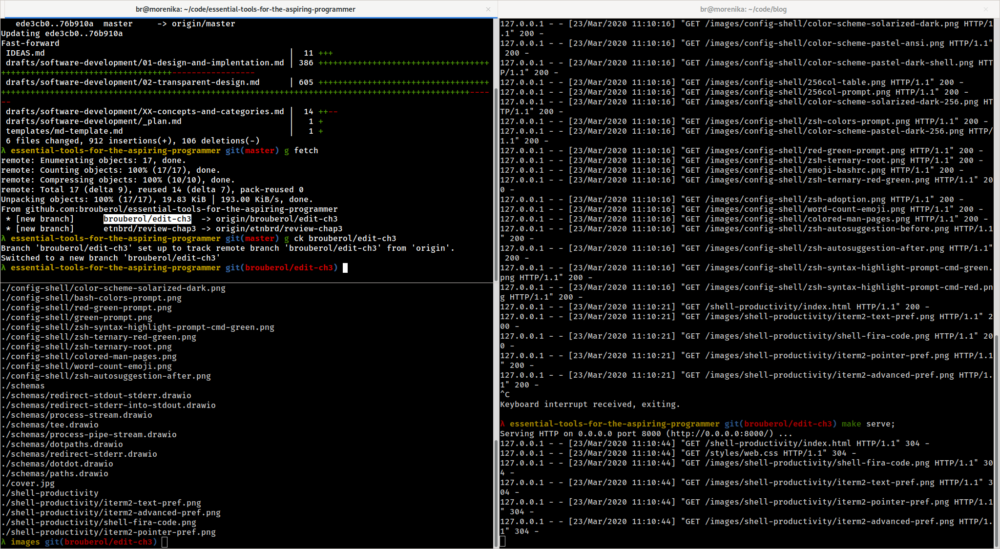
<span class=imgcaption>I can work in multiple panes within the same tab, and have one tab per project</span>

Here are the terminator keyboard shortcuts I find the most useful:

| Shortcut                                          |                         Action|
|---------------------------------------------------|------------------------------:|
| <kbd>Ctrl</kbd> - <kbd>Shift</kbd> - <kbd>E</kbd> |    split the screen vertically|
| <kbd>Ctrl</kbd> - <kbd>Shift</kbd> - <kbd>O</kbd> |  split the screen horizontally|
| <kbd>Ctrl</kbd> - <kbd>Shift</kbd> - <kbd>T</kbd> |                 open a new tab|
| <kbd>Ctrl</kbd> - <kbd>PageUp</kbd>               |         switch to the next tab|
| <kbd>Ctrl</kbd> - <kbd>PageDown</kbd>             |     switch to the previous tab|
| <kbd>Ctrl</kbd> - <kbd>N</kbd>                    |              open a new window|
| <kbd>Ctrl</kbd> - <kbd>Shift</kbd> - <kbd>+</kbd> |                        zoom in|
| <kbd>Ctrl</kbd> - <kbd>Shift</kbd> - <kbd>-</kbd> |                       zoom out|
| <kbd>Ctrl</kbd> - <kbd>D</kbd>                    |     close the current terminal|

### iTerm2

As far as macOS is concerned, I find the default terminal (plainly named
Terminal) to be hard to use. The terminal that seems to be widely
accepted by the macOS programming community is iTerm2[^2]. It has all of
the features cited above, and many (many) more!

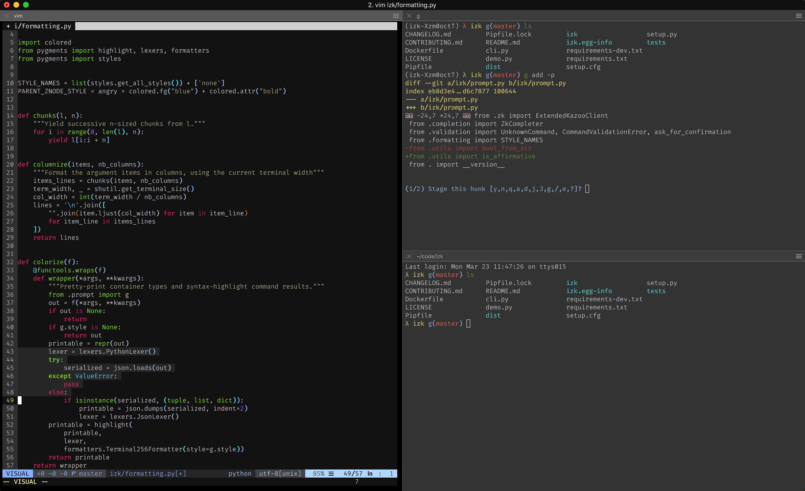
<span class=imgcaption>iTerm2 looks similar to Terminator but can do much, much more</span>

The iTerm2 keyboard shortcuts I find the most useful are:

| Shortcut                                         |                         Action|
|--------------------------------------------------|------------------------------:|
| <kbd>Cmd</kbd> - <kbd>D</kbd>                    |    split the screen vertically|
| <kbd>Cmd</kbd> - <kbd>Shift</kbd> - <kbd>D</kbd> |  split the screen horizontally|
| <kbd>Cmd</kbd> - <kbd>T</kbd>                    |                 open a new tab|
| <kbd>Cmd</kbd> - <kbd>Shift</kbd> - <kbd>+</kbd> |                        zoom in|
| <kbd>Cmd</kbd> - <kbd>Shift</kbd> - <kbd>-</kbd> |                       zoom out|
| <kbd>Cmd</kbd> - <kbd>N</kbd>                    |              open a new window|
| <kbd>Cmd</kbd> - <kbd>D</kbd>                    |     close the current terminal|

The following sections go over some non-default iTerm2 settings that I
find convenient. Again, these are my preference and are in no way
prescriptive. Feel free to discard them if you want.

#### Open file shortcut

One of the iTerm2 features I enjoy is the ability of using
<kbd>Cmd</kbd> + mouse click on a file path or an URL, to open the
resource with the default associated program. For example, it will open
an URL in your browser, a path to a local PDF file with Preview, a text
file with your preferred text editor, etc.

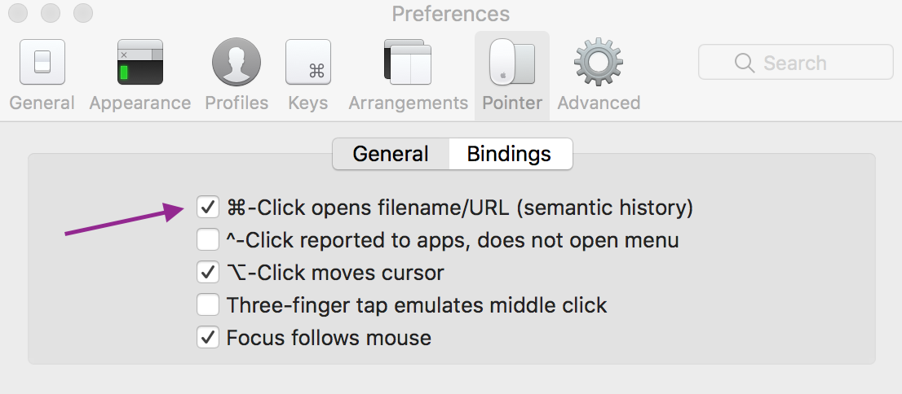
<span class=imgcaption>By enabling this feature, you will be able to open a file using a graphical application from your terminal</span>

#### Intuitive location for new terminals

Another tweak I've done to iTerm2 was changing the working directory new
terminals will open into by default. What I wanted was

-   open a new terminal window in my home directory
-   open a new terminal tab in my home directory
-   open a new terminal split pane in the previous session's directory

I did this because I oftentimes found myself splitting the current tab
when I want to run multiple commands within the same project, and I had
to `cd` into the project directory every time I did a pane split.


<span class=imgcaption>I reduced the time I spent `cd`-ing into project directories with these settings. Preferences \> Profiles \> General \> Working Directory \> Advanced Configuration \> Edit</span>

<a id="what-font-should-i-use"></a>
## What font should I use?

Using a font you enjoy is paramount. If you spend a lot of time reading
and writing in your terminal, you might as well do it using a font that
feels right to you.

I personally really enjoy the Fira Code[^3] font, both in my text editor
and my terminal. Not only does it look really nice on the eye, but it
also contains a set of *ligatures* for multi character combinations,
such as `!` and `=` rendered in a single character, allowing you to read
code and decode symbols more easily.

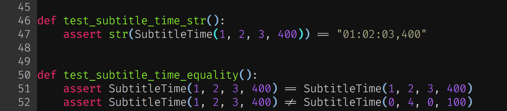
<span class=imgcaption>Example of rendered character ligatures</span>

Note that not all terminals support fonts with ligatures. For example,
iTerm2 does but Terminator does not.

<div class="Note" markdown="1">

While Fira Code has my preference, there are other well-designed fonts
including ligatures, such as JetBrains Mono.[^4]

</div>

<a id="what-shell-should-i-use"></a>
## What shell should I use?

We have hinted at it until now: `bash` is not the only shell out there.
You are free to use other shells if you want, such as `zsh`, `fish`,
`nushell`, … As it was the case with terminals, the “good” terminal
really depends on your definition of “good”. If you deeply care about
using the same shell on every machine you work on, then `bash` is
possibly for you. It has been around since 1989, is stable, mature and
is the default shell on almost[^5] every UNIX system out there.

When researching this book, I was surprised to learn that `zsh` (or the
Z-shell) wasn't really the last “kid on the block” either, as it was
first released in 1990, just a year after the first stable bash release!
You can expect the same level of stability, maturity and even syntax (to
a large extent, except when it comes to configuration) than bash.

I personally think `zsh` really shines by providing a powerful default
auto-completion experience, as well as more configuration options. As
`zsh` is compatible with `bash`'s own syntax, I encourage you to try
them until you feel comfortable with one or the other.

The `fish`[^6] shell takes a radical turn from `bash` or `zsh` by
providing an incompatible but “simple and clean” syntax, an extremely
powerful command suggestion system, and an interactive configuration
wizard.

If you are getting started with using the shell, my personal
recommendation is to stick to `bash` or `zsh` and experiment with other
shells to see what value they bring once you feel more confident.

### Changing your default shell

The `chsh` (standing for *change shell*) command allows you to change
your default shell.

**Examples**:

``` extbash
# Switching to bash by default
$ chsh -s /bin/bash
```

``` extbash
# Switching to zsh by default
$ chsh -s /bin/zsh
```

Once you have run `chsh`, any new terminal window you open will run your
new default shell.

<a id="configuring-your-shell"></a>
## Configuring your shell

Up until now, every example we have seen have defined environment
variables, aliases and functions directly in the shell. However, if we
closed that shell, all of these changes would be undone and we would
have to start again the next time we open a new one. Fortunately, all of
these settings can be persisted in a *configuration file*. Adding
aliases, environment variables and functions to that file will make sure
they get imported every time you open a new shell.

These files usually reside in your home directory, and are named
`.bashrc` for bash, and `.zshrc` for zsh.

``` extbash
$ cat ~/.zshrc
export EDITOR=vim
export PATH=$HOME/bin

alias ls='ls -G'
alias ..='cd ..'
alias ...='cd ../..'
alias filesize='ls --size --human-readable -1'

function mkcd {
    local target=$1
    mkdir -p $target
    cd $target
}
```

After adding anything to your shell configuration file, you need to run
`source ~/.zshrc` (or `source ~/.bashrc`, depending on your shell). The
`source` built-in command reads and executes commands from the argument
file name in the current shell environment. Said in another way, running
`source ~/.<file>` will cause the shell to reload its configuration.

<div class="Note" markdown="1">

`rc` stands for *run commands*. Indeed, when you `source` your
configuration file, you will run the commands it contains. The subtlety
with `source` is that it executes the argument script within your
*current* shell, meaning any sourced commands will have a side-effect on
your running shell.

</div>

If you can never remember a given command's options, or if you always
find yourself typing a group of commands, I encourage you to define
aliases and functions in your shell configuration file. They will allow
you to feel more productive day after day, especially so if the alias
and tools are abstracting complex commands.

<div class="Note" markdown="1">

The previous chapter ended with some real-life examples of alias and
functions. Feel free to add them to your shell configuration file.

</div>

<a id="configuring-your-prompt"></a>
## Configuring your prompt

Configuring your <span class="gls" key="prompt">prompt</span> is a very
good way to make the shell work for you as much as possible, by
providing you with useful context, such as the time of day, whether the
last command was successful, your current working directory… While they
can provide context and information to you, they will carry that context
to anyone you copy and paste a command and associated output to.

Configuring your prompt is done by changing the value of the `PS1`
environment variable.

``` extbash
$ export PS1="MY COOL PROMPT $"
MY COOL PROMPT $
```

I think we can agree that `MY COOL PROMPT` is not as informative as it
could, so let's change it to put our prompt to work. As the prompt
configuration work slightly different between `bash` and `zsh`, we will
address both cases in two different sections.

### Configuring your bash prompt

The `PS1` environment variable can be defined by using a mix and match
of both regular and special characters. The regular characters are just
displayed as-is, whereas the backslash-escaped special characters are
interpreted by bash at the time `PS1` is displayed and replaced by the
associated value. The most useful special characters are defined as
follows.

| Character | Meaning                                                                 |
|-----------|-------------------------------------------------------------------------|
| `\h`      | The hostname up to the first dot                                        |
| `\t`      | The current time, in 24-hour HH:MM:SS format                            |
| `\u`      | The current user's username                                             |
| `\w`      | The full current working directory (`$HOME` rendered as `~`)            |
| `\W`      | The basename of the current working directory (`$HOME` rendered as `~`) |
| `\n`      | A new line                                                              |

These special characters are evaluated every-time the prompt is displayed to make sure you always get the most up-to-date context.

<div class="Note" markdown="1">

The `PROMPTING` section of the `bash` manual contains the full list of
backslash-escaped special characters.

</div>

**Examples**

``` extbash
$ export PS1='\u@\h \W $'
br@morenika ~ $
```

``` extbash
$ export PS1='[\t] \u@\h \W $'
[13:33:55] br@morenika ~ $
```

``` extbash
$ export PS1='[\t \u@\h:\w]\n>>> '
[13:57:55 br@morenika:~/code]
>>>
```

<div class="Note" markdown="1">

You can use online tools such as ezprompt[^7] to try different
configurations until you find something you like.

Whatever `PS1` value you settle with should be persisted and exported in
your `.bashrc` configuration file.

</div>

### Configuring your zsh prompt

`zsh` exposes a bit more options than `bash` when it comes to prompt
configuration. Both `PS1` and `PROMPT` environment variable can be set
to the same effect, if you find `PROMPT` more explicit.

Instead of being backslash-escaped, zsh's special characters are
prefixed by `%`, and are called *prompt sequences*. The most useful are
detailed here.

| Sequence  | Meaning                                                                   |
|-----------|---------------------------------------------------------------------------|
| `%m`      | The hostname up to the first dot                                          |
| `%*`      | The current time, in 24-hour HH:MM:SS format                              |
| `%n`      | The current user's username                                               |
| `%~`      | The full current working directory (`$HOME` rendered as `~`)              |
| `%1~`     | The basename of the current working directory (`$HOME` rendered as `~`)   |
| `%?`      | The exit status of the last command executed                              |
| `%%`      | A %                                                                       |
| `$'\n'`   | A new line                                                                |
| `%B (%b)` | Start (stop) bold font mode                                               |
| `%F (%f)` | Start (stop) using a given foreground color, if supported by the terminal |

<div class="Note" markdown="1">

You will find the full list of prompt sequences in the zsh
documentation[^8].

</div>

**Examples**

``` extzsh
$ export PROMPT='%n@%m %~ $ '
br@morenika ~/code $
```

``` extzsh
$ export PROMPT='[%*] %n@%m %~ $ '
[23:38] br@morenika ~/code $
```

``` extzsh
$ export PROMPT="[%* %n@%m %~]"$'\n'">>> "
[23:41 br@morenika ~/code/izk]
>>>
```

``` extzsh
$ export PROMPT="[%* %n@%m %1~]"$'\n'"%% "
[23:41 br@morenika izk]
%
```

`zsh` goes even further by letting you define the content of a
right-sided prompt, through the `RPROMPT` environment variable, which
uses the same syntax as `PROMPT`.

**Example**

``` extzsh
$ export PROMPT='%~ $ '; export RPROMPT='%*'
~/code $                                              21:04:00
```

<div class="Note" markdown="1">

To make sure your changes are persisted, `PROMPT` and `RPROMPT` should
be exported in your `.zshrc` configuration file.

</div>

### Adding Colors

Adding color is a good way to spice up your prompt as well as providing
some visual context. You can use color to indicate whether you are
running with super-user privileges, if the last command succeeded or
failed, or simply colorized each individual part of your prompt
(username, hostname, etc) in a different way to make it even simpler to
parse.

#### Adding color to your bash prompt

Bash allows you to style elements of your prompt by using 3-bit ANSI[^9]
codes defining a zone associated with a potential effect, foreground
color and background color.

Each effect, background or foreground color has an associated code,
described in the following tables. The combination of these parameters
is called <span class="gls" key="sgr">Select Graphic Rendition</span>,
which is defined as a semicolon (;) separated list of codes.

<div class="fullwidth" markdown="1">

| Effect         |  ANSI Code|
|----------------|----------:|
| Normal         |        `0`|
| Bold           |        `1`|
| Faint          |        `2`|
| Italic         |        `3`|
| Underline      |        `4`|
| Strike through |        `9`|

| Background Color |  ANSI Code|
|------------------|----------:|
| Red              |       `41`|
| Green            |       `42`|
| Brown            |       `43`|
| Blue             |       `44`|
| Purple           |       `45`|
| Cyan             |       `46`|
| White            |       `47`|
| Bright black     |      `100`|
| Bright red       |      `101`|
| Bright green     |      `102`|
| Bright brown     |      `103`|
| Bright blue      |      `104`|
| Bright purple    |      `105`|
| Bright cyan      |      `106`|
| Bright white     |      `107`|

| Foreground Color |  ANSI Code|
|------------------|----------:|
| Black            |       `30`|
| Red              |       `31`|
| Green            |       `32`|
| Brown            |       `33`|
| Blue             |       `34`|
| Purple           |       `35`|
| Cyan             |       `36`|
| White            |       `37`|
| Bright black     |       `90`|
| Bright red       |       `91`|
| Bright green     |       `92`|
| Bright brown     |       `93`|
| Bright blue      |       `94`|
| Bright purple    |       `95`|
| Bright cyan      |       `96`|
| Bright white     |       `97`|

</div>

**Examples of SGRs**

-   blue text: `34`
-   bold green text: `1;32`
-   purple text on a white background: `35;47`
-   bold red text on a bright cyan background: `1;31;106`
-   bold and striked-through brown text on a green background
    `1;9;33;42`

To define colorized zones in your bash prompt, use the following
(granted, ugly) syntax:

    \e[<SGR>mTEXT\e[m

**Examples**

``` extbash
$ export PS1='[\t] \u@\h \W \e[32m$\e[m '
```


<span class=imgcaption>The `$` sign is now displayed in green</span>

``` extbash
$ export PS1='\e[31m\u\e[m@\e[32m\h\e[m \e[36m\W\e[m $ '
```

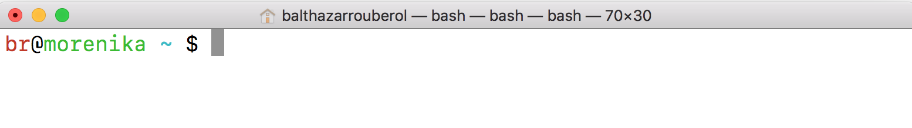
<span class=imgcaption>The username is in red, the hostname in green and the path is in cyan. </span>

##### Color palettes

Notice how an ANSI code only maps to a color name? That's because it is
up to your *terminal* to interpret and render that color name into an
actual color, meaning that the same prompt configuration could be
rendered differently on two different terminals.

Mapping ANSI color names to actual <span class="gls"
key="rgb">RGB</span> colors is done through what is called *color
palettes*.

Following are two different color schemes, as well as the associated
rendered prompt, both using the same `PS1` value, used in the previous
example.

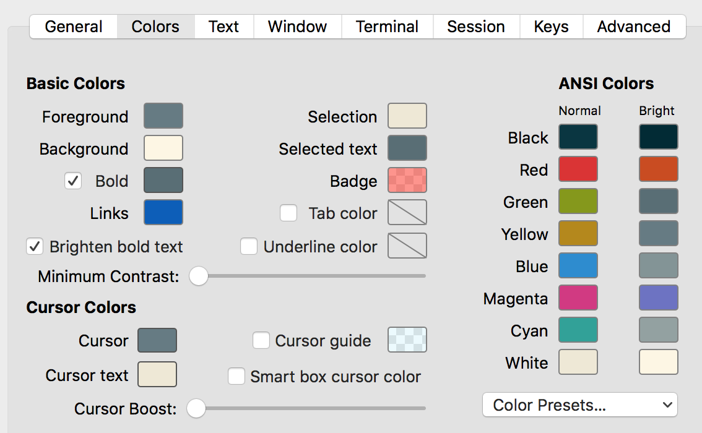

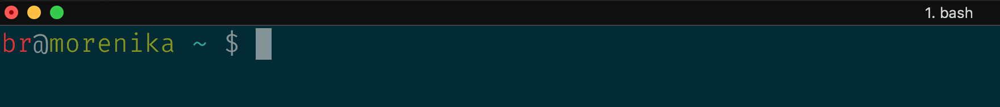
<span class=imgcaption>The popular Solarized Dark color scheme</span>

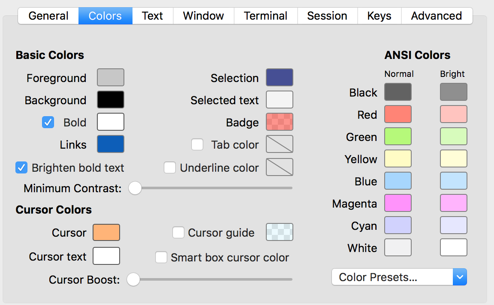

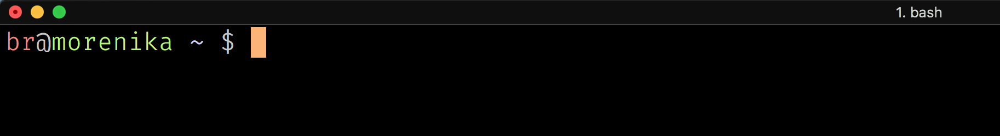
<span class=imgcaption>The Pastel (Dark Background) color scheme</span>

As you can see, these both look quite different from the prompt
displayed in <span class="ref" key="fig:basic-prompt-colors">the
previous screenshot</span>, even though the underlying prompt
configuration is exactly the same. This means that, even if using 16
colors can feel limiting, you actually can map these colors to any color
you like. The ANSI color system just prevents you from having more than
16 *different* colors in your prompt.

<div class="Note" markdown="1">

I recommend you to have a look at the
`mbadolato/iTerm2-Color-Schemes`[^10] project, showcasing popular color
palettes and providing you with the configuration files allowing you to
used them in many terminal applications (and not just iTerm2 contrary to
what its name suggests).

</div>

##### Up to 256 colors

As computers eventually started to have 256 colors graphics card, a 8
bit ANSI code scheme was introduced, allowing the user to render 256
colors in their terminal, instead of 16.

The 8-bit ANSI code syntax is `\e[38;5;n` where the colors associated
with each value of `n` between 0 and 255 are represented in the
following table[^11].

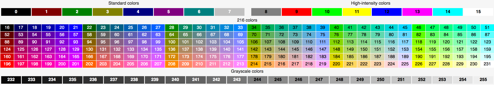
<span class=imgcaption>The 8-bit ANSI code allows you to render more than the initial 16 available colors</span>

**Examples**

``` extbash
# Using 256-bit ANSI codes
$ TIME="[\e[38;5;33m\t\e[m]"  # blue
$ USERNAME="\e[38;5;200m\u\e[m"  # pink
$ HOSTNAME="\e[38;5;139m\h\e[m"  # purple
$ WORKDIR="\W"  # no color
$ DOLLAR="\e[38;5;41m$\e[m"  # green
$ export PS1="${TIME} ${USERNAME}@${HOSTNAME} ${PTH} ${DOLLAR} "
```

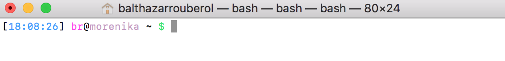
<span class=imgcaption>These ANSI codes sure are awful to read but they make for pretty colors </span>

<div class="Note" markdown="1">

Not all terminals support 256 colors, but most of the modern ones
should. To this day, GNOME Terminal, Konsole, Terminator, XFCE4
Terminal, iTerm2, Terminal (macOS) and tmux all support 256 colors.

</div>

Contrary to the 3-bit ANSI codes, the 8-bit codes are insensitive to
color schemes changes, as shown in the following examples, both re-using
the same `PS1` configuration than in the <span class="ref"
key="fig:256col-prompt">previous screenshot</span>.

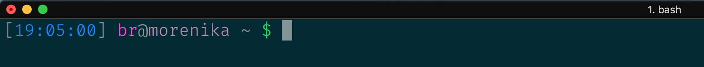

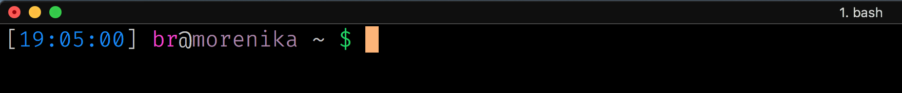
<span class=imgcaption>The colors remain unchanged</span>

#### Adding color to your zsh prompt

Everything we've explained in the previous section is still valid for
`zsh`: you can use 3 or 8 bit ANSI color codes just fine. However, `zsh`
also provides you with a much easier and readable color system:

-   each color can be represented as either `black`, `red`, `green`,
    `yellow`, `blue`, `magenta`, `cyan` or `white`, or a number between
    0 and 255
-   `%F{color}Text%f`: changes the `Text` foreground color to `color`
-   `%K{color}Text%k`: changes the `Text` background color to `color`
-   `%BText%b`: displays `Text` in boldface
-   `%UText%u`: underlines `Text`

**Example**

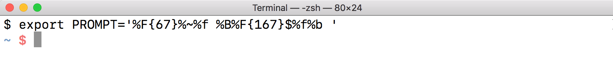
<span class=imgcaption>The current working directory in blue and the dollar sign in bold pink</span>

### Displaying dynamic data in the prompt

We can make our prompt display dynamic context to make it even more
informative. To do this, we can execute a function as part of our `PS1`
environment variable. The shell will call that function every time it
renders the prompt.

The idea is to be able to have as much information as possible in your
prompt at the ready, but *only when necessary*.

#### Displaying dynamic data in bash

Let's say that we want to colorize the `$` of our prompt in green if the
last command was successful, and in red if it failed. We can wrap that
logic into the following `colorized_prompt` bash function, and have it
called every time `PS1` is rendered by including `$(colorized_prompt)`
in the environment variable.

The `$(colorized_prompt)` syntax means "call the `colorize_prompt` function", and will be expanded into the output of the function (what it prints), which will contain ASCII color codes colorizing the prompt.

``` extbash
function colorized_prompt {
    if [[ $? ]]; then
        printf "\e[32m$\e[m"
    else
        printf "\e[31m$\e[m"
    fi

}
export PS1='[\t] \W $(colorized_prompt) '
```

<div class="Note" markdown="1">

`$?` is a special bash parameter that expands to the *exit status* of the previously executed command. The norm is to have an exit status of 0 if the command executed successfully, and any other exit status indicates an error.


```extbash
$ pwd
/home/br
$ echo $?
0
$ cmdnotfound
bash: cmdnotfound: command not found
echo $?
127
```

The syntax `if [[ $? ]]; then` thus translates to “if the last command
executed successfully, then…”.

</div>

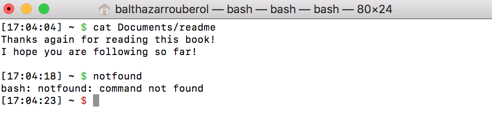
<span class=imgcaption>The prompt is green after a successful command and red after a failed one</span>

#### Displaying dynamic data in zsh

Dynamic data can be injected in your prompt the same way than in bash,
by executing functions at rendering time. `zsh` however provides you
with *ternary conditionals*, that is to say expressions that either
evaluate to one value or the other depending on a condition, to reach
the same goal. A ternary conditional has the following syntax

``` extzsh
%(<condition>.<success value>.<failure value>)
```

If the condition is true, then the expression is evaluated to the
success value. On the other hand, if the condition is false, the
expression will be evaluated to the failure value.

You can read a ternary conditional as *if condition, then, else*. It's
actually a common pattern called *ternary expression* you might
encounter in many programming languages.

Here is a list of useful built-in conditions provided by `zsh`.

| Condition | Meaning                                                                      |
|-----------|------------------------------------------------------------------------------|
| `n?`      | True if the previous command exited with the exit status *n*                 |
| `nd`      | True if the day of the month is equal to n                                   |
| `nw`      | True if the day of the week is equal to n (Sunday = 0).                      |
| `!`       | True if the shell is running with super-user privileges (as the `root` user) |

**Examples**

``` extzsh
$ export PROMPT='%F{%(0?.green.red)}$ %f'
```

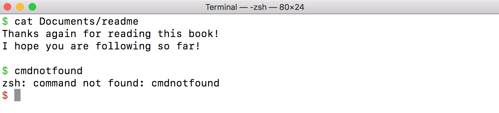
<span class=imgcaption>Displays a dollar prompt in green if the last command was successful, or red if it failed</span>

``` extzsh
$ export PROMPT='%* %1~ %(!.#.$) '
```

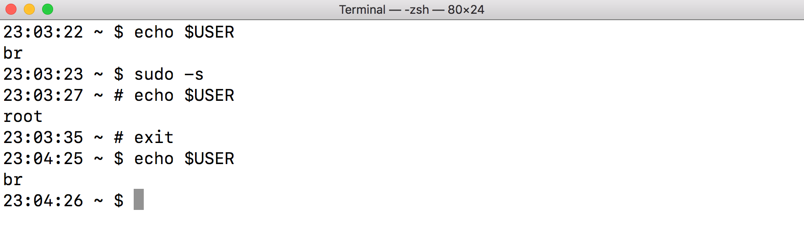
<span class=imgcaption>Display a dollar sign if you run your regular user, and a hash if you are running in super-user mode</span>

<div class="Note" markdown="1">

The full list of ternary conditionals is available in the zsh
documentation[^12].

</div>

### Adding emoji to your prompt

Modern terminal support non-ASCII characters, such as emoji. Like
colors, they can be convenient to convey information in a very
space-efficient fashion.

For example, during the process of writing that book, I displayed the
associated total word count in my prompt to keep me motivated. That word
count would however only be displayed when I was located in the root
directory of the project, in the spirit of only displaying context when
necessary.

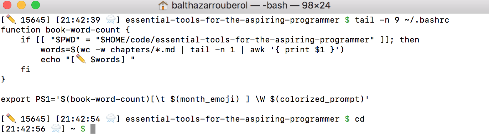

<a id="shell-configuration-frameworks"></a>
## Shell configuration frameworks

Up until now, we have seen how to tailor your prompt by adding colors,
context, dynamic information computed on-the-fly. While you can
certainly spend hours customizing up to “perfection” (trust me, I have
been there…), you can also take another route and benefit from other
people's work, using a shell configuration <span class="gls"
key="framework">framework</span>.

These frameworks provide you with a large choice of prompt themes,
helpers, options, additional command auto-completions, plug-ins, and are
regularly updated by a community of developers around the world.

To this day, the most famous `zsh` configuration frameworks are Oh My
Zsh[^13] and Prezto.[^14] While we can't fully attribute `zsh`'s success
to them (Oh My Zsh was first released around 2010, 20 years after zsh's
first release), they certainly have helped in driving community adoption
in the last couple of years[^15].

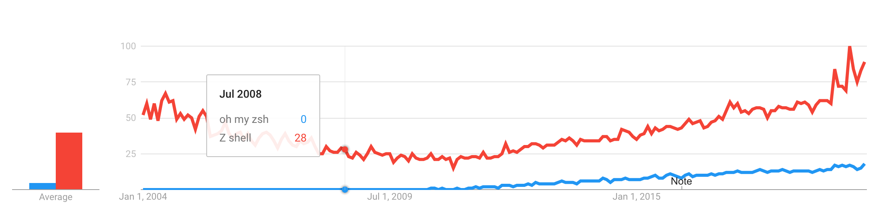
<span class=imgcaption>Comparison of Google Trends associated with zsh and Oh My Zsh</span>

We will introduce you to the concepts behind Oh My Zsh, but it will then
be up to you to explore, and select a theme as well as plug-ins you like
(or even not use them at all!). After all, it is *your* development
environment, and henceforth, your choice.

<div class="Note" markdown="1">

`bash` has a similar framework, inspired by Oh My Zsh, called
`bash-it`.[^16] We won't cover it in details but we encourage you to
look at it if don't feel like using `zsh` but still want to use a
configuration framework.

</div>

### Oh My Zsh

Quoting the official website,

> Oh My Zsh is a delightful, open source, community-driven framework for
> managing your Zsh configuration. It comes bundled with thousands of
> helpful functions, helpers, plug-ins, themes, and a few things that
> make you shout…

To install it, run the following command in a shell, which will download
an installation script, and run it on your computer.

``` extbash
$ sh -c "$(curl -fsSL https://raw.github.com/ohmyzsh/ohmyzsh/master/tools/install.sh)"
```

Once the script has finished running, you should see a message stating
that Oh My Zsh has been installed, and that plug-ins, themes and options
should be enabled by changing the configuration living under `~/.zshrc`.

Before, we do, let's inspect our environment variables, to see how Oh My
Zsh configures itself.

``` extbash
$ printenv | grep ZSH
ZSH=/home/br/.oh-my-zsh
```

That `ZSH` environment variable points to the Oh My Zsh installation
directory. The framework also injected a couple of other variables
defining specific configuration values.

``` extbash
$ set | grep ZSH
ZSH=/home/br/.oh-my-zsh
ZSH_ARGZERO=zsh
ZSH_CACHE_DIR=/home/br/.oh-my-zsh/cache
ZSH_COMPDUMP=/home/br/.zcompdump-morenika-5.7.1
ZSH_CUSTOM=/home/br/.oh-my-zsh/custom
ZSH_EVAL_CONTEXT=toplevel
ZSH_NAME=zsh
ZSH_PATCHLEVEL=zsh-5.7.1-0-g8b89d0d
ZSH_SPECTRUM_TEXT='Arma virumque cano Troiae qui primus ab oris'
ZSH_SUBSHELL=1
ZSH_THEME=robbyrussell
ZSH_VERSION=5.7.1
```

#### Picking a theme

We can see that the default theme is `robbyrussell` (Robby Russell[^17]
is the creator of Oh My Zsh). The full list of available themes is
available online[^18], along with screenshots.

You can also get the list by running the following command, as all
themes are defined in `$ZSH/themes`.

``` extbash
$ ls -1 $ZSH/themes | sed 's/.zsh-theme//'
3den
adben
af-magic
afowler
...
```

I suggest you scroll through the themes wiki, or simply pick a theme at
random from the previous command output, edit your `~/.zshrc`
configuration file by updating the value of the `ZSH_THEME` variable,
and run `source ~/.zshrc` to reload it. That will get you a whole new
shell theme!

Feel free to rinse and repeat until you find a theme that suits you. In
the case where no built-in theme finds grace in your eyes, you can also
explore the external theme wiki[^19]. If you find an external theme you
like, download its associated `.zsh-theme` file, and place it under
`$ZSH/themes`, then edit `~/.zshrc`, and update the `ZSH_THEME`
accordingly.

<div class="Note" markdown="1">

If you want to further personalize a theme using some of the techniques
we covered in that chapter, I'd advise you clone it and maintain a
separate version, as your tweaks might get overridden at the next theme
update.

Export the `ZSH_CUSTOM` environment variable to `$ZSH/custom`, then run
the following commands.

``` extbash
$ mkdir -p $ZSH/custom/themes
$ cp $ZSH/themes/$ZSH_THEME.zsh-theme $ZSH/custom/themes/$ZSH_THEME-custom.zsh-theme
```

Then add `ZSH_THEME=<old zsh theme>-custom` to your `~/.zshrc`.

</div>

#### Useful configuration options

Oh My Zsh has a couple of options you can enable or disable by editing
`~/.zshrc`. I suggest you take a look at them and choose what to
activate. Here are some personal recommendations.

##### Automatic command correction

zsh can suggest a command correction if it detects a mistyped command.
To enable the automatic command correction, add
`ENABLE_AUTO_CORRECTION='true'` to `~/.zshrc`.

``` extzsh
$ sl
zsh: correct 'sl' to 'ls' [nyae]? y
Android                bin   Desktop    Downloads  Firefox_wallpaper.png  Pictures
AndroidStudioProjects  code  Documents  Dropbox    Music                  Videos
```

The 4 options are:

-   `n` (no): run the mistyped command
-   `y` (yes): run the suggested command
-   `a` (abort): stop and do nothing
-   `e` (edit): edit your command before re-running it

<div class="Note" markdown="1">

zsh's auto-correction feature can sometimes be over-zealous and is not
to everyone's liking[^20]. If you end up repeatedly fighting it for a
given command (e.g. `git status` wrongly autocorrected to `git stats`),
you can define an alias for the command by prefixing it with
`nocorrect`.

``` extzsh
alias git status='nocorrect git status'
```

</div>

##### Automatic Oh My Zsh updates

To make sure you regularly get new plug-ins and bug fixes, Oh My Zsh can
automatically and regularly update itself. To do so, set the following
options in `~/.zshrc`:

-   `DISABLE_UPDATE_PROMPT=true`: update Oh My Zsh without asking for
    confirmation
-   `UPDATE_ZSH_DAYS=30`: update Oh My Zsh every 30 days

#### Add plug-ins

Oh My Zsh comes with more than 250 plug-ins, each of them either
defining aliases or improved auto-completion for a given set of
commands. Refer to the Oh My Zsh wiki page[^21] to see the full list of
available plug-ins. To enable a given plug-in, add its name to the
`plugins` list in `~/.zshrc`, then run `source ~/.zshrc`.

**Example**:

``` diff
- plugins=(git)
+ plugins=(git python)
```

If you regularly use a command listed in the plug-in wiki page, you
should probably try to enable the associated plug-in! I however suggest
enabling the following general-purpose plug-ins.

-   `common-aliases`[^22]: Collection of useful aliases, not enabled by
    default since they may change some user defined aliases
-   `colored-man-pages`: colorize `man` pages

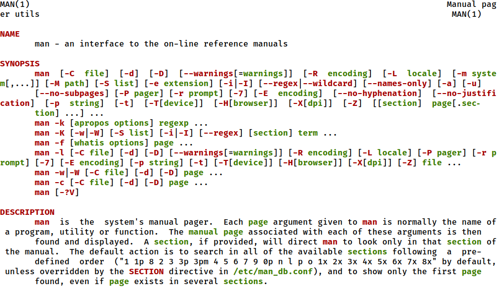
<span class=imgcaption>Colorized man pages are much easier to read!</span>

-   `extract`: define an `extract` alias that can extract any type of
    archive (.zip, .tar.gz, .bzip, etc)[^23]

The following plug-ins are not provided by default, I find them so
useful that I suggest you install them and give them a try.

-   `zsh-autosuggestions`[^24]: emulate the `fish` autosuggestion by
    suggesting commands as you type them, saving you from using
    <kbd>Ctrl</kbd> - <kbd>R</kbd> to look into your shell history. Any
    suggestion can be accepted by hitting <kbd>→</kbd> or ignored by
    just continuing typing.


<span class=imgcaption>I just typed `ls` and I immediately get a completion suggestion</span>

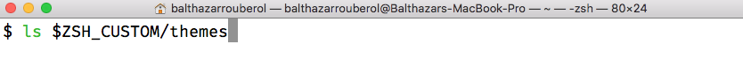
<span class=imgcaption>Suggestion accepted!</span>

-   `zsh-syntax-highlighting`[^25]: provide syntax highlighting within
    the zsh command line. It also colorizes the name of the command you
    type in green if it is found, and in red if not.


<span class=imgcaption>`ls` is a valid command</span>


<span class=imgcaption>`cmdnotfound` is not</span>

#### Uninstalling Oh My Zsh

If you find that Oh My Zsh isn't for you, you can uninstall it by
running the `uninstall_oh_my_zsh` function. Your previous configuration
will be restored.

<a id="summary"></a>
## Summary

I strongly believe that learning how to configure and personalize your
own shell is an important part of becoming a developer. I'd even go as
far as calling it a ritual. On a personal level, it helped me overcome
the almost mystic reputation of the terminal by making it my own.

Configuring your shell might never really be fully completed. Do you
find yourself executing a long command repeatedly? Make it an alias. If
an alias does not cut it, or if it should take arguments, write a shell
function instead. Are you oftentimes wondering on which branch, project
or profile you are currently running? Add it to your prompt. If your
prompt starts to feel a little crowded, you might be able to condense it
by using colors and emoji.

Making your own tools and customizing your shell is an investment, but
it is also an inherent part of being a software developer, which will
allow you to do more, faster, and will help you feel more at home in
your shell. It's also quite a bit of fun!

<a id="going-further"></a>
## Going further

**4.1**: Look into your terminal's preferences and try to change the
color scheme, or remap ANSI colors to different RGB colors.

**4.2**: Try different fonts, such as `Source Code Pro`,
`Fira Code Pro`, `Inconsolata` or `Jetbrains Mono` and pick the one you
like most

**4.3**: Explore your terminal preferences, and experiment with
different settings.

**4.4**: Try to change the colors of the different sections of your
prompt

[^1]: <https://gnometerminator.blogspot.com/p/introduction.html>

[^2]: <https://iterm2.com/>

[^3]: <https://github.com/tonsky/FiraCode>

[^4]: <https://www.jetbrains.com/lp/mono/>

[^5]: <https://www.theverge.com/2019/6/4/18651872/apple-macos-catalina-zsh-bash-shell-replacement-features>

[^6]: <https://fishshell.com>

[^7]: <http://ezprompt.net>

[^8]: <http://zsh.sourceforge.net/Doc/Release/Prompt-Expansion.html>

[^9]: <https://en.wikipedia.org/wiki/ANSI_escape_code>

[^10]: <https://github.com/mbadolato/iTerm2-Color-Schemes>

[^11]: Source: <https://en.wikipedia.org/wiki/ANSI_escape_code#Colors>

[^12]: <http://zsh.sourceforge.net/Doc/Release/Prompt-Expansion.html#Conditional-Substrings-in-Prompts>

[^13]: <https://ohmyz.sh>

[^14]: <https://github.com/sorin-ionescu/prezto>

[^15]: Source:
    <https://trends.google.com/trends/explore?date=all&q=oh%20my%20zsh,%2Fm%2F0nrgk>

[^16]: <https://github.com/Bash-it/bash-it>

[^17]: <https://github.com/robbyrussell>

[^18]: <https://github.com/ohmyzsh/ohmyzsh/wiki/Themes>

[^19]: <https://github.com/ohmyzsh/ohmyzsh/wiki/External-themes>

[^20]: <https://github.com/ohmyzsh/ohmyzsh/issues/534>

[^21]: <https://github.com/ohmyzsh/ohmyzsh/wiki/Plugins>

[^22]: <https://github.com/ohmyzsh/ohmyzsh/wiki/Plugins#common-aliases>

[^23]: <https://www.xkcd.com/1168/>

[^24]: <https://github.com/zsh-users/zsh-autosuggestions/blob/master/INSTALL.md>

[^25]: <https://github.com/zsh-users/zsh-syntax-highlighting/blob/master/INSTALL.md>


<footer>
<p>
<em>Essential Tools and Practices for the Aspiring Software Developer</em> is a self-published book project by Balthazar Rouberol and <a href=https://etnbrd.com>Etienne Brodu</a>, ex-roommates, friends and colleagues, aiming at empowering the up and coming generation of developers. We currently are hard at work on it!
</p>
<p>The book will help you set up a productive development environment and get acquainted with tools and practices that, along with your programming languages of choice, will go a long way in helping you grow as a software developer.
  It will cover subjects such as mastering the terminal, configuring and getting productive in a shell, the basics of code versioning with <code>git</code>, SQL basics, tools such as <code>Make</code>, <code>jq</code> and regular expressions, networking basics as well as software engineering and collaboration best practices.
</p>
<p>
  If you are interested in the project, we invite you to join the <a href=https://balthazar-rouberol.us4.list-manage.com/subscribe?u=1f6080d496af07a836270ff1d&id=81ebd36adb>mailing list</a>!
</p>
</footer>
